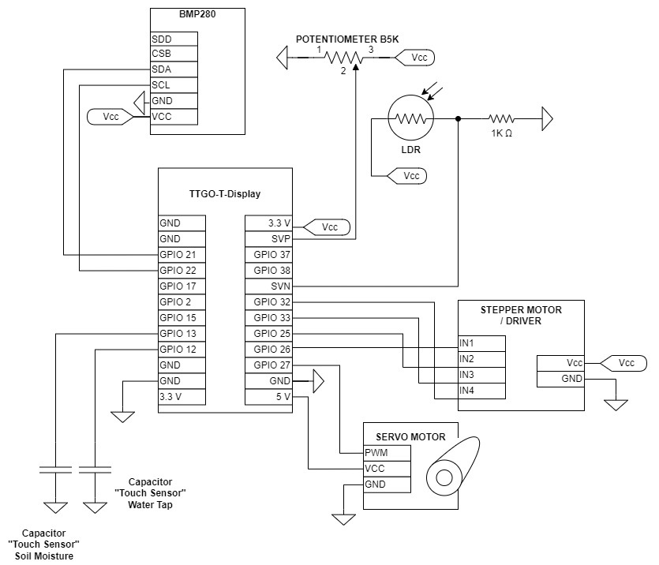

# "Slimme Serre"

It's required to have a file [./src/Credentials.h](./src/Credentials.h) and [./src/config.h](./src/config.h) in the `./src` folder.

Make sure this is added before building the project. You can copy and fill in [./src/Credentials.h.default](./src/Credentials.h.default)
and/or [./src/config.h.default](./src/config.h.default) respectively.

### Diagram

